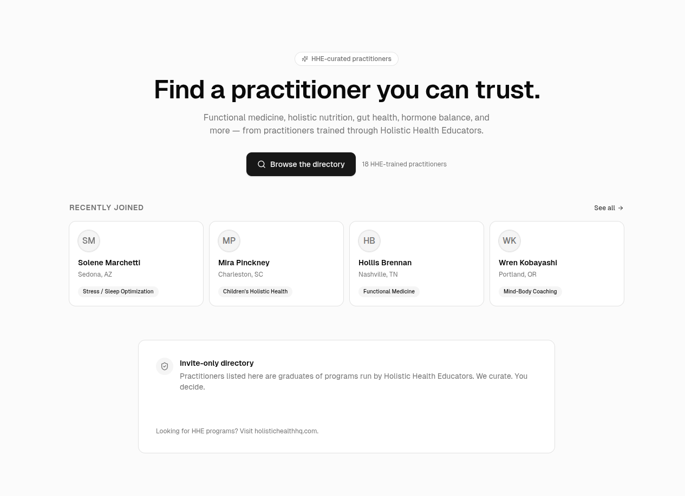
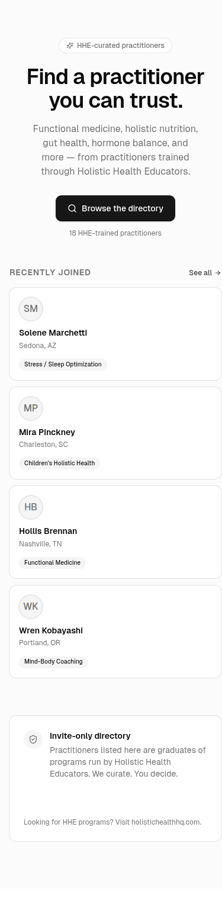
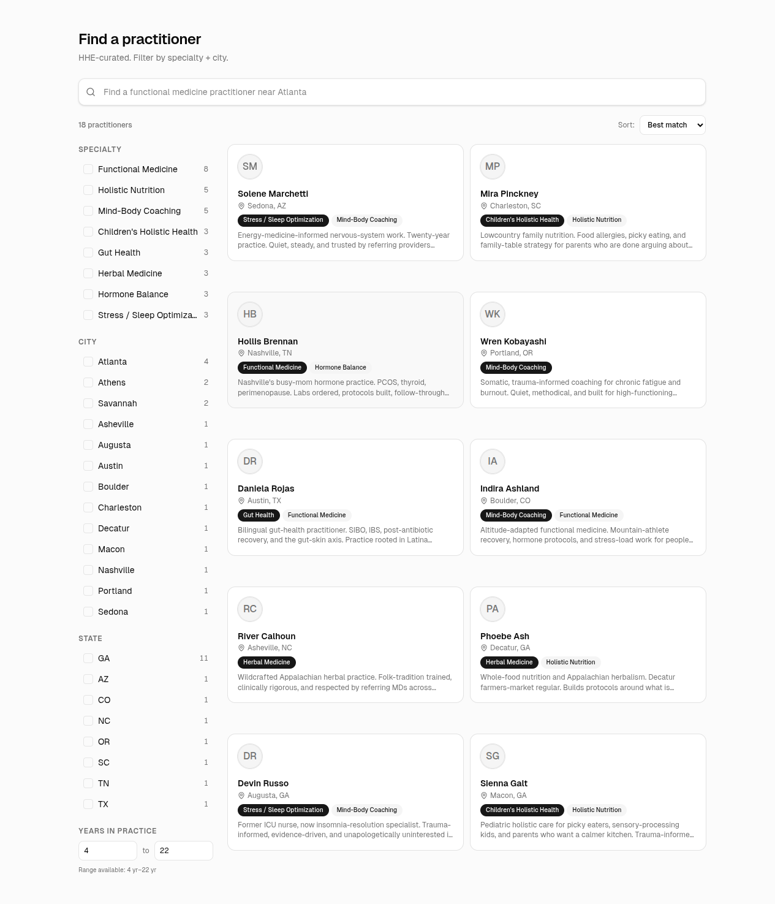
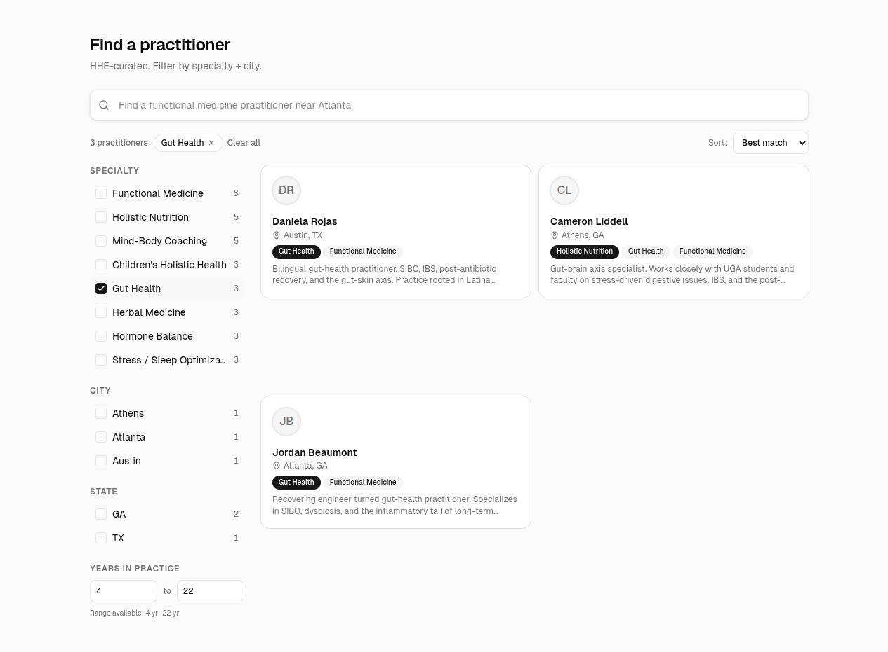
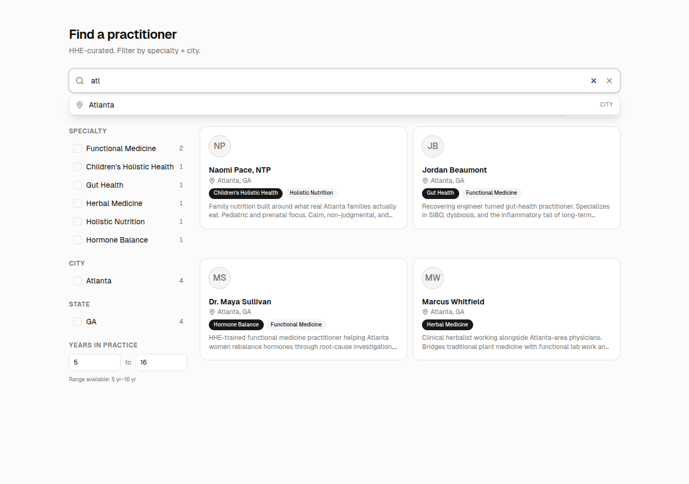
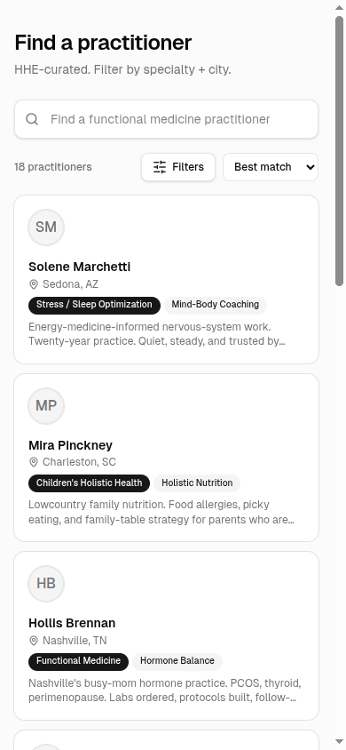
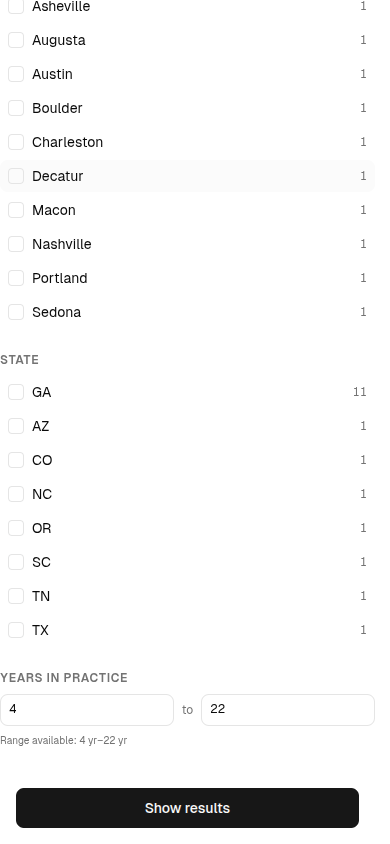
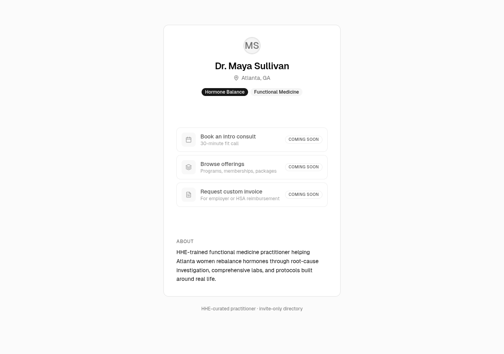
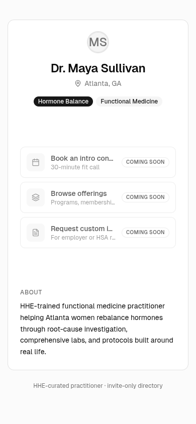

# Demo Prep — Amy meeting 2026-05-28

> **Production URL**: https://hhe-directory.vercel.app
> **Goal**: 5-7 minute walkthrough that lets Amy feel HHE-curated practitioner discovery as a working product, not a deck.
> **Wedges proven**: search-as-discovery, HHE-students-first sourcing, click-through to a polished practitioner profile. Payments + booking are Phase 2 (intentionally placeholder).

## Three-act story arc

### Act 1 — Landing (`/`)

**What Amy sees**: "Find a practitioner you can trust." Hero + CTA + recently-joined cards.

**Talking point**: "This is the front door HHE students and prospective patients hit. It's HHE-curated — every practitioner here is a graduate of a program you run."

**Key signals to call out**:
- "18 HHE-trained practitioners" — concrete count, not vapor
- "Recently joined" — implies invite-acceptance flow (Phase 2 mechanic)
- "Invite-only directory" footer card — anti-NPI-scrape framing front and center

**Screenshots**:
- Desktop: 
- Mobile: 

### Act 2 — Search & filter (`/search`)

**What Amy sees**: Full directory + Amazon-style adaptive facets + typo-tolerant keyword search.

**Talking points** (in order, each ~30s):

1. **"Type a specialty"** — e.g., "hormone" → results narrow. Show that "gut helth" with the typo still finds gut-health practitioners.
2. **"Filter by city"** — click Atlanta → results narrow to GA-Atlanta. Specialty facet auto-updates counts.
3. **"Filter by specialty + city together"** — show that Atlanta + Hormone Balance narrows further. Cross-facet conjunctive scoping in action.
4. **"Adaptive facet pruning"** — when no values remain in a category, the whole category disappears. The filter sidebar shows you only what's possible from where you are.
5. **"Mobile view"** — Filters button opens a slide-up Sheet. Designed for the way real patients actually search (on their phone).

**Key signals**:
- 61% Georgia practitioners — visible in the State facet ("GA 11"). Subtle proof the data was curated for HHE's footprint, not bulk-scraped.
- HHE-graduate framing in bios — "Recovering engineer turned gut-health practitioner," "Twelve years post-pharmacy" — every card reads like a real practitioner, not a phonebook entry.
- URL state — every filter combo is shareable. Useful for Amy to send links to specific practitioner sets.

**Screenshots**:
- Initial desktop: 
- Specialty filtered (Gut Health): 
- Autocomplete (typing "atl"): 
- Mobile search: 
- Mobile facet Sheet open: 

### Act 3 — Profile click-through (`/practitioners/[slug]`)

**What Amy sees**: Linktree-style practitioner profile — Avatar + name + city + specialty badges + 3 action placeholders + bio.

**Talking points**:
- **"Linktree-style"** — Blake's framing from 5/15. Each "element" (book a consult, browse offerings, request invoice) is a moveable surface a practitioner can configure.
- **"Coming soon" badges** — set expectations: payments + booking are Phase 2 (gated on Whop/WAP work Blake owes), but the *shape* of the page is real.
- **"HHE-curated practitioner · invite-only directory"** — footer reaffirms the wedge.

**Screenshots**:
- Desktop: 
- Mobile: 

## Likely Amy questions + prepared answers

| Question | Answer |
|---|---|
| **"How do practitioners get listed?"** | Invite-only model. Phase 2 builds the invitation flow (email + accept link → claim profile → fill in). Currently seeded with 18 HHE-graduate-style records to show what the data layer feels like. |
| **"What if someone searches for a specialty we don't have yet?"** | The taxonomy is hierarchical (4 parents, 4 children today). Adding new specialties is a one-row change. Search re-indexes automatically when practitioners update their specialty selection. |
| **"How fast does new info show up?"** | Phase 1 today: practitioner edits → search index in <2 seconds (app-layer reindex on save). Phase 2 moves to a cron-driven mark-and-sweep for batch resilience. |
| **"Can someone search by insurance / fee / availability?"** | Schema supports range facets — already demonstrated with "years in practice" (4-22yr slider). Adding fee range or insurance accepted is a schema field + UI line. Phase 2 ready. |
| **"What happens when we hit 500 practitioners? 2,000?"** | Stack tested for that scale. Typesense Cloud (current tier) handles it; if RAM pressure shows up at 2K, one-click tier-up in their dashboard. Cost ceiling: ~$50/mo until revenue justifies more. |
| **"Is this competing with holistichealthhq.com?"** | No. Landing page links to it. HHE Directory is the *practitioner-finding* surface; holistichealthhq is the *program-marketing* surface. They feed each other. |
| **"What about payments / booking?"** | Phase 2A + 2B shipped 5/25: practitioner-side onboarding + booking is real (any scheduling provider — Cal.com, Calendly, etc.). Phase 2C (payments) is the open item. Operator-confirmed direction: Whop for Platforms / Connected Accounts (centralized multi-tenant routing — HHE platform, practitioners as connected sellers, optional platform fee). **Blocker**: Whop Platforms API is invite-only — need Blake/Amy alignment on (1) Whop as the right primitive vs alternatives, and (2) who emails sales@whop.com to apply. Worth raising in the meeting if Amy asks. |
| **"Who do I show this to next?"** | Anyone HHE-trained you'd want listed. Cost to add: 1 invite email, 5-minute profile completion. Phase 2 makes that real; Phase 1 today just needs your approval to proceed. |

## Failure modes + recovery paths

| If this happens | Do this |
|---|---|
| **Typesense Cloud is down** | The /search page shows an error state. The /practitioners/[slug] pages still work (they use Prisma directly). Fall back to: "let me click into a profile to show what the discovery destination feels like." |
| **Wifi flaky in the meeting** | Production URL works on cellular. If neither works: open the screenshots in `docs/demo-prep/` and walk through them. Story arc is the same. |
| **Amy asks about a practitioner that doesn't exist** | "These are seed practitioners showing what the data shape feels like. Phase 2's invitation system adds real people — the demo today is about the *experience*, not the inventory." |
| **Mobile Safari has a layout bug we missed** | Open desktop view on a laptop screen. The desktop UI is identical product, just wider. |
| **A facet count looks off** | Adaptive facets use disjunctive semantics within a category (specialty multi-select) and conjunctive across (city/state single-select). Counts reflect those rules. If pressed: "the system shows you 'what's possible if I add this' within the same filter, and 'narrowed counts' across filters — same as Amazon." |

## Critical Blake/Amy follow-up — raise this at the meeting

**Phase 2C (payments) is the one substantive open item from the Phase 2 sequencing.** Operator-locked target architecture: **Whop for Platforms** (Whop's Stripe-Connect-equivalent — multi-tenant payment routing where HHE is the platform and practitioners are connected accounts receiving direct payouts).

**Blocker**: Whop Platforms API is **invite-only**. The current Whop API key on file is standard creator-account scope (validated empirically 5/25 — returns 401 on `/connected_accounts`).

**What needs Blake/Amy alignment** (capture during the meeting or in 24-48hr follow-up):
1. **Confirm Whop is the right primitive** vs Stripe Connect / custom marketplace / pass-through paymentURLs. Blake had Whop work in scope from the 5/15 call — does that scope cover Whop for Platforms specifically, or just standard Whop creator integration?
2. **Application logistics**: who emails `sales@whop.com`? What HHE Directory positioning to include in the request (practitioner volume target, expected GMV, compliance needs)?
3. **Timeline**: Whop's underwriting can take days to weeks. If 2C is on critical path, plan accordingly.
4. **Interim?**: Until 2C lands, public profiles show "Coming soon" on Browse offerings + Request custom invoice. Acceptable for the 5/28 demo (the wedge story is search→filter→book, not search→filter→pay), but Amy should know payments lands in a follow-up phase.

## Day-of operations

- **5/27 (day before)**: visit https://hhe-directory.vercel.app/search, run through the story arc once. Confirm response times feel right.
- **5/28 morning**: refresh the page once before Amy arrives. Vercel cold start is 2-3 seconds first hit; warm thereafter.
- **In-meeting laptop**: have a backup tab open to https://hhe-directory.vercel.app (the landing). If search misbehaves, jump to the landing to reset context.
- **Phone backup**: have https://hhe-directory.vercel.app/search loaded on your phone before walking in. If laptop fails entirely, hand Amy your phone.

## What's NOT in the demo (and why)

| Thing | Why it's not shown |
|---|---|
| Practitioner edit/claim flow | Phase 2 — needs auth providers + invitation email infrastructure |
| Payments / booking | Phase 2 — gated on Whop/WAP work Blake owes |
| Real practitioners | Phase 1 today seeds 18 HHE-graduate-style records. Real practitioners come in via Phase 2 invitations |
| Geo "near me" search | Schema supports it (haversine + geopoint). Phase 1.5 add — needs the browser geolocation prompt UX |
| Saved searches / accounts | Phase 2 — needs auth providers |

## After the meeting

- **If Amy is green-lit**: proceed to Phase 2 — auth providers, invitation flow, payments wedge.
- **If Amy wants changes**: capture them in writing before leaving the room. Update `docs/PHASE-1-PLAN.md` and `~/vault/300 Entities/Projects/PracticeNear.md` Progress Log within 24 hours.
- **If Amy wants more practitioners visible**: Phase 1.5 add — generate more seed records OR push for Phase 2 invitation flow as the first real-data unlock.
- **If Amy wants to share the URL**: it's already live. https://hhe-directory.vercel.app — no gate, no signup. Forward with confidence.

## Reference

- Full requirements: `docs/SEARCH-REQUIREMENTS.md`
- Operator runbook (envs, cluster ops): `docs/SEARCH-SETUP.md`
- Phase 1 plan: `docs/PHASE-1-PLAN.md`
- Seed strategy memory: `~/.claude/projects/-home-jgatlit-projects-HHE-HHE-directory/memory/pattern_seed_strategy.md`
- Decisions-JSON (5/15 scope lock): `~/Downloads/practicenear-decisions-2026-05-15.json`
